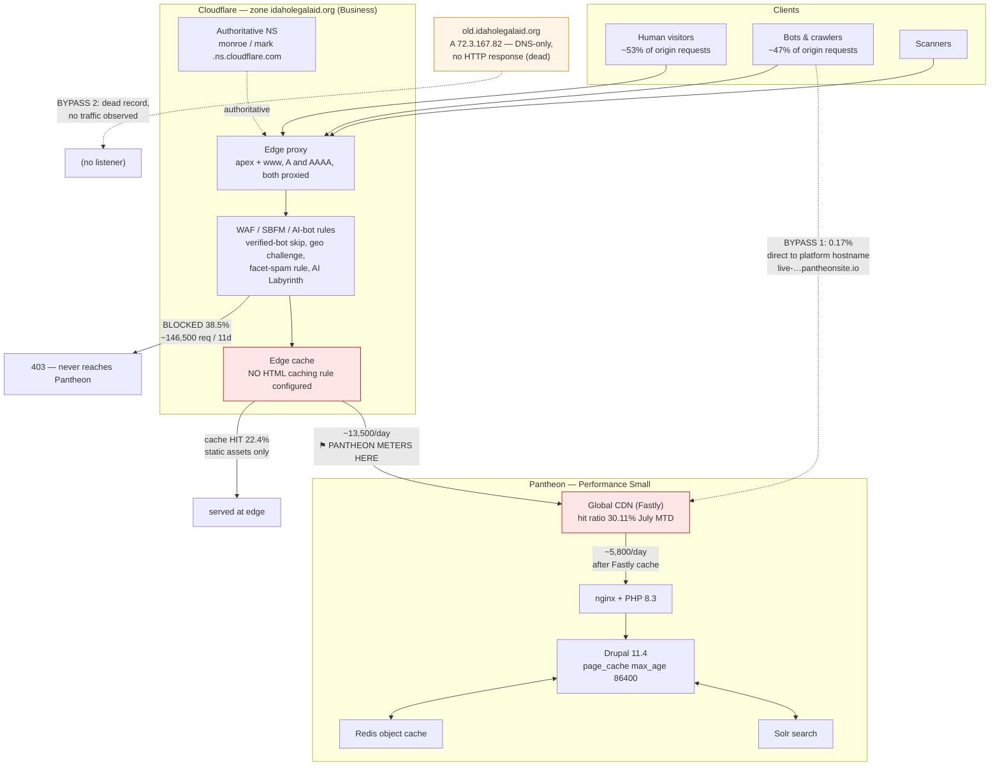

# Pantheon + Cloudflare Traffic and Billing Audit

**Site:** `idaho-legal-aid-services` (UUID `0bbb0799-…eba3f`) · Live environment
**Plan:** Performance Small · **Audit date:** 2026-07-28
**Author:** Claude Code, read-only investigation. No production changes were made.

---

## 1. Executive summary

The premise behind this audit — that Cloudflare is misconfigured and letting traffic
leak to Pantheon — is **not supported by the evidence**. Cloudflare is correctly in
front of the site: **99.83 % of all requests reaching the Pantheon origin arrived via
Cloudflare** (66,575 of 66,691 requests over 11.5 days of raw nginx logs). Only 116
requests bypassed it, and most of those were a WordPress scanner probing the Pantheon
platform hostname.

The audit did find three substantial problems, but only one of them affects the
**billed** number:

1. **A large share of origin work is pure waste.** 23.6 % of origin requests are 404s
   and 12.4 % are 301 redirects — 36 % of all origin traffic. Every one is
   structurally uncacheable (`Cache-Control: must-revalidate, no-cache, private`), so
   each hits PHP. **404s and 301s account for 111 % of Pantheon's reported cache
   misses** — that is, essentially *all* cache misses are errors and redirects, not
   real page traffic. The largest single component is 6,832 requests (10.2 % of all
   origin traffic) for favicon and apple-touch-icon files that do not exist.

2. **This waste does not reduce your bill.** Pantheon's published definition is
   explicit: a visit requires a **200-level (or 303/304/305) response**, and
   redirects, 4xx responses, static assets, and known bots are **excluded**. So
   fixing the 404/301 flood improves performance, cost of compute, and crawl budget
   — but moves the counted-visit number by roughly zero. This is the single most
   important thing to understand before spending money on a plan upgrade.

3. **The reducible portion of counted visits is about 15 %.** Modelling Pantheon's
   own visit definition against the raw logs reproduces their number to within 3 %,
   and within that population roughly **14.7 % of counted visits come from automated
   clients Pantheon does not recognise as bots** (browser-spoofing user agents that
   fetch HTML but never fetch a single CSS, JS, or image file).

**There is one unresolved question that changes the entire financial conclusion**, and
it needs a dashboard screenshot to settle (see §11). Pantheon's API reports **36,676
visits for July month-to-date**, while you reported 22,800. Those cannot both describe
the same window. Until that is resolved, the plan recommendation is conditional — see
§14 and §15.

---

## 2. Exact definition of the Pantheon metric

From Pantheon's current documentation (`docs.pantheon.io/metrics`, retrieved
2026-07-28):

| Term | Pantheon's definition |
|---|---|
| **Visits** | "a 200-level (as well as 303, 304, 305) response code in response to a visitor." A unique visitor is "a combination of user agent (device/browser) and IP address," counted **once per day** regardless of return frequency. |
| **Pages Served** | "the number of requests for resources generated by the CMS… Most commonly these are HTML web pages, but they also include non-HTML resources such as JSON, RSS, or XML-RPC." Allowance = **5 ×** the plan's monthly visit limit. |
| **Cache Hit Ratio** | "the number of requests that can be served from the Global CDN." Pantheon states this **"doesn't affect site traffic measurements."** |

**Explicitly excluded from counted visits:**

- Known bots and crawlers
- Repeat requests from the same IP on the same day
- Static assets (images, PDFs, CSS, JS)
- **Redirect responses (301, 302, 307, 308)**
- **Client errors (400-level responses)**

### 2.1 Verification against raw logs

I modelled this definition independently against 11.5 days of nginx access logs and
compared it to what Pantheon's API reports for the same days:

| Check | Modelled from logs | Pantheon API | Agreement |
|---|---:|---:|---:|
| Counted visits (unique non-bot IP+UA per day) | 16,643 | 16,109 | **0.97×** |
| Cache misses explained by 404 + 301 | 22,995 | 20,673 | **1.11×** |
| Pages served ÷ non-asset origin requests | — | — | 0.48 |

The visit model reproduces Pantheon's number to within 3 %. This is strong evidence
that `terminus env:metrics` **visits** already applies bot filtering, and that the
metric genuinely is "unique human-looking IP+UA pairs per day."

**The ratio of 1.11 on cache misses is the headline technical finding.** It means the
404s and redirects alone slightly *over*-explain every cache miss Pantheon records.
There is no separate population of uncacheable real page traffic to find.

---

## 3. Billing-cycle projection

### 3.1 Observed data (`terminus env:metrics …live --period=day`)

Daily visits, July 2026 (all 27 complete days):

```
Jul 01 1420   Jul 08 1659   Jul 15 1531   Jul 22 1529
Jul 02 1171   Jul 09 1466   Jul 16 1459   Jul 23 1666
Jul 03 1078   Jul 10 1471   Jul 17 1189   Jul 24 1683
Jul 04  847   Jul 11  993   Jul 18  757   Jul 25 1870
Jul 05  737   Jul 12  807   Jul 19  760   Jul 26 1427
Jul 06 1411   Jul 13 1483   Jul 20 1671   Jul 27 1912
Jul 07 1640   Jul 14 1394   Jul 21 1645
```

**July 1–27 total: 36,676 visits** (matches the monthly aggregate exactly).

### 3.2 Three projections to 2026-07-31

Remaining days (Jul 28–31) are Tue/Wed/Thu/Fri — all weekdays, which matters because
weekend traffic runs 40–50 % below weekdays.

| Method | Calculation | Projected month-end |
|---|---|---:|
| **1. Simple daily run rate** | 36,676 ÷ 27 × 31 | **42,111** |
| **2. Weighted to last 7 days** | 36,676 + (11,732 ÷ 7 × 4) | **43,380** |
| **3. Weekday-adjusted** | 36,676 + Tue 1,560 + Wed 1,535 + Thu 1,441 + Fri 1,355 | **42,566** |

**Convergent range: 42,100 – 43,400 visits.** The three methods agree within 3 %,
which is expected this late in a cycle. Sensitivity is low: with 27 of 31 days
elapsed (87 %), even a ±30 % swing in the remaining four days moves the total by only
±4 %. Had this audit run on day 8, the same methods would have spread by 25 % or more.

### 3.3 Historical context (`--period=month`)

| Month | Visits | Pages served | Cache hit ratio |
|---|---:|---:|---:|
| 2025-10 | 102,846 | 210,286 | 5.48 % |
| 2025-11 | 45,513 | 83,200 | 12.44 % |
| 2025-12 | 34,369 | 90,421 | 14.29 % |
| 2026-01 | 62,997 | 99,848 | 19.85 % |
| 2026-02 | 45,934 | 89,632 | 32.19 % |
| 2026-03 | 72,564 | 111,384 | 70.26 % |
| 2026-04 | 82,879 | 123,428 | 68.01 % |
| 2026-05 | 37,447 | 63,431 | 87.54 % |
| 2026-06 | 42,144 | 67,971 | 88.90 % |
| **2026-07 (MTD)** | **36,676** | **61,348** | **30.11 %** |

**Growth rate:** there is no sustained growth trend. The 12-month series is volatile
(34k–103k) and July MTD is *below* June and roughly level with May. Traffic is flat
to slightly declining, not growing. This materially weakens the case for an upgrade
driven by demand.

---

## 4. Current architecture



Two things are flagged red: Cloudflare performs **no HTML caching**, and Pantheon's
Global CDN hit ratio has collapsed to 30 %. Both are explained in §8.

---

## 5. DNS and hostname findings

### 5.1 Records observed

| Hostname | Type | Value | Proxied? | Assessment |
|---|---|---|---|---|
| `idaholegalaid.org` | A | 172.66.154.4, 104.20.17.150 | Cloudflare | ✅ Correct |
| `idaholegalaid.org` | AAAA | 2606:4700:10::6814:1196, …ac42:9a04 | Cloudflare | ✅ **No IPv6 bypass** |
| `www.idaholegalaid.org` | A / AAAA | identical to apex | Cloudflare | ✅ Correct |
| `idaholegalaid.org` | NS | monroe / mark `.ns.cloudflare.com` | — | ✅ Full Cloudflare DNS |
| `mail.idaholegalaid.org` | A | 216.251.32.97 | DNS-only | ✅ Expected (mail) |
| `old.idaholegalaid.org` | A | 72.3.167.82 | DNS-only | ⚠️ **Legacy, dead** |
| `live-idaho-legal-aid-services.pantheonsite.io` | — | fe2.edge.pantheon.io / 23.185.0.2 | **Not proxied** | ⚠️ **Public origin** |
| `_dmarc` | TXT | `v=DMARC1; p=none; rua=…dmarc-reports.cloudflare.net` | — | ✅ Now configured |

Probed and **absent** (no bypass surface): `www2, secure, shop, app, docs, files, cdn,
static, help, support, intranet, vpn, remote, dev, test, staging, stage, blog, api,
assistant, admin, portal, m`.

### 5.2 `old.idaholegalaid.org` — confirmed dead

DNS resolves to `72.3.167.82`, but neither HTTP nor HTTPS returns any response, and
the IP has no reverse DNS. It is a stale record from a prior host. **No traffic was
observed to it.** Risk is low (it is a dangling record, a minor subdomain-takeover
consideration), and cleanup is housekeeping, not a traffic fix.

### 5.3 Pantheon platform hostname is publicly reachable

`https://live-idaho-legal-aid-services.pantheonsite.io/` returns **HTTP 200** with the
full site and no Cloudflare headers. Two consequences:

- **Canonical leak (confirmed):** the page emits
  `<link rel="canonical" href="https://live-idaho-legal-aid-services.pantheonsite.io/">`.
  Root cause: `config/metatag.metatag_defaults.global.yml:10` uses
  `[current-page:url:absolute]`, which reflects whatever `Host` header was received.
- **Mitigated indexing risk:** Pantheon serves its own `Disallow: /` robots.txt on
  platform hostnames, so search engines will not index it.

**Measured impact: 116 requests over 11.5 days (0.17 %).** Of those, 44 were a
WordPress scanner from `80.82.65.0/24` probing `/wp-json/`, `/wp/index.php` etc., and
~40 were `34.135.247.0/24` (Google Cloud) fetching the homepage plus its assets —
consistent with a screenshot or preview service. This is a real but **immaterial**
bypass. Closing it is worth doing for hygiene, not for billing.

### 5.4 Host handling at the origin

Verified by sending explicit `Host` headers to the platform hostname:

- `Host: www.idaholegalaid.org` → **301** to `https://idaholegalaid.org/`
- `Host: idaholegalaid.org` → **200**

So the www→apex canonicalisation works, but it is performed **at the Pantheon origin**,
meaning every `www` request costs a full origin round trip before the redirect. Note
also that `trusted_host_patterns` is `'.*'` (`web/sites/default/settings.pantheon.php:186`)
and the `.htaccess` www rules are commented out and inert on nginx anyway — there is
no application-layer host allowlist at all.

### 5.5 No hostname leaks in shipped code

A repo-wide grep across `config/`, `web/modules/custom/`, `web/themes/custom/`, and
`web/sites/` for `pantheonsite.io` returned **zero** matches. All 70 absolute-URL
references in `config/` point to `https://idaholegalaid.org`. Clean.

---

## 6. Pantheon traffic findings

Source: raw nginx access logs pulled over SFTP from the live appserver
(`logs/nginx/nginx-access.log` plus 11 rotated `.gz` archives).

**Coverage: 2026-07-17 → 2026-07-28, 66,691 requests, 100 % parsed (0 unparsed lines).**

> **Note on appservers.** DNS advertises two appservers. `34.19.168.179` holds the
> complete rotated log set and is serving essentially all traffic; `35.203.61.32` has a
> single stale 143 KB log last written 2026-07-21 and no rotations. Analysis uses the
> active appserver. A small unmeasured tail may exist on the second.

### 6.1 Response status distribution

| Status | Count | Share | Counts as a visit? |
|---|---:|---:|---|
| 200 | 41,522 | 62.26 % | ✅ Yes |
| **404** | **15,740** | **23.60 %** | ❌ No |
| **301** | **8,256** | **12.38 %** | ❌ No |
| 304 | 817 | 1.23 % | ✅ Yes |
| 429 | 312 | 0.47 % | ❌ No |
| other (302/403/405/400/303/415/499/206) | 44 | 0.07 % | mixed |

**36 % of everything the origin does is an error or a redirect.**

### 6.2 Path categories

| Category | Requests | Share |
|---|---:|---:|
| HTML pages | 49,527 | 74.26 % |
| **Missing icons** (favicon / apple-touch-icon / manifest) | **6,832** | **10.24 %** |
| Documents (PDF etc.) | 6,489 | 9.73 % |
| Static assets | 1,812 | 2.72 % |
| **Legacy `/sites/idaholegalaid.org/files/` paths** | **1,566** | **2.35 %** |
| API / AJAX | 417 | 0.63 % |
| Scanner probe paths | 48 | 0.07 % |

### 6.3 The missing-icon problem — largest single waste

| Path | 404s |
|---|---:|
| `/favicon.ico` | 3,829 |
| `/apple-touch-icon.png` | 1,435 |
| `/apple-touch-icon-precomposed.png` | 1,285 |
| `/apple-touch-icon-120x120*.png` | 204 |
| `/manifest.json` | 40 |
| `/apple-touch-icon-152x152*.png` | 36 |
| `/sites/idaholegalaid.org/files/favicon.ico` | 16 |
| `/favicon.png` | 3 |
| **Total** | **6,848** |

**Root cause, confirmed.** The site declares only an SVG icon:

```html
<link rel="icon" href="/sites/default/files/ILAS%20Favicon_1.svg" type="image/svg+xml" />
```

(from `config/b5subtheme.settings.yml:19-21`, `path: 'public://ILAS Favicon_1.svg'`).

- There is **no `/favicon.ico`** at the docroot. `web/themes/custom/b5subtheme/favicon.ico`
  exists but is not served at the root path. Browsers fall back to `/favicon.ico` by
  convention → 3,829 404s.
- There is **no `apple-touch-icon` link tag at all** — `html.html.twig` contains no
  icon markup. iOS/Safari therefore probes the conventional filenames → 2,960 404s.

Each of these fully bootstraps Drupal and returns
`Cache-Control: must-revalidate, no-cache, private` with
`X-Drupal-Cache: UNCACHEABLE (response policy)`, so **it is never absorbed by any
cache layer and recurs on every page view.**

### 6.4 Legacy file paths — broken links we control

1,566 requests to `/sites/idaholegalaid.org/files/…` (the Drupal 7 file path; the
current path is `/sites/default/files/…`). All 404. Worst offenders:

| Path | 404s |
|---|---:|
| `…/Protections%20for%20Debit%20Card%20and%20Electronic%20Transactions%20Fact%20Sheet.pdf` | 386 |
| `…/mortgage_interestonly.pdf` | 130 |
| `…/Assistive_Animal_Brochure.pdf` | 69 |
| `…/What%20is%20Community%20Property%20Guide%20-%20FINAL.pdf` | 63 |
| `…/MANUFACTURED%20HOMES.brochure.pdf` | 43 |

The referrer data confirms these are **linked from our own pages** (referrers are
`https://www.idaholegalaid.org/…` and `https://idaholegalaid.org/`), not external
scrapes. These are genuine broken links harming real users, not just bots.

### 6.5 Top redirect targets

8,256 301s. Highest-volume sources are legacy D7 URL patterns:

| Path | 301s |
|---|---:|
| `/coeur-dalene-office` | 202 |
| `/about-us/locations/boise-office` | 197 |
| `/locations` | 159 |
| `/boise-office` | 126 |
| `/nampa-office` | 124 |
| `/files/HEALTHY-HOUSING.pdf` | 121 |
| `/about-us/locations/idaho-falls-office` | 104 |

Split by requester: **4,413 from bots, 3,843 from human-UA clients.** Googlebot alone
issued 1,466 redirect requests — 38 % of all its traffic — meaning a substantial share
of crawl budget is being burned on redirects.

### 6.6 Traffic by user-agent category

| Category | Requests | Share | 404 rate |
|---|---:|---:|---:|
| browser_like | 35,332 | 52.98 % | 13.5 % |
| **seo_scraper** | **10,330** | **15.49 %** | **62.0 %** |
| ai_crawler | 6,347 | 9.52 % | 0.4 % |
| **unknown_ua** | **4,304** | **6.45 %** | **93.4 %** |
| googlebot | 3,824 | 5.73 % | 1.6 % |
| generic_bot | 1,893 | 2.84 % | 1.0 % |
| bingbot | 1,678 | 2.52 % | 13.6 % |
| other_search | 1,555 | 2.33 % | 4.5 % |
| social | 1,376 | 2.06 % | 10.6 % |
| http_library | 40 | 0.06 % | 2.5 % |
| monitoring | 12 | 0.02 % | 0.0 % |

**Roughly 47 % of origin requests are non-human.** Two categories stand out for
producing almost nothing but errors: `seo_scraper` (62 % 404) and `unknown_ua`
(93.4 % 404). Together they generate **10,428 of the 15,740 total 404s — 66 %.**

Top individual agents:

| User agent | Requests | Share |
|---|---:|---:|
| SemrushBot/7~bl | 7,292 | 10.93 % |
| Chrome/150 on Windows (generic) | 6,847 | 10.27 % |
| ChatGPT-User/1.0 | 4,433 | 6.65 % |
| Chrome/150 Android (generic) | 4,286 | 6.43 % |
| Googlebot/2.1 | 2,549 + 902 | 5.17 % |
| Safari iOS 18.7 | 2,375 | 3.56 % |
| `NetworkingExtension/… iOS/26.5.2` | 2,025 | 3.04 % |
| bingbot/2.0 | 1,536 | 2.30 % |
| ClaudeBot/1.0 | 1,516 | 2.27 % |
| serpstatbot/2.1 | 1,221 | 1.83 % |
| IbouBot/1.0 | 1,048 | 1.57 % |
| Baiduspider/2.0 | 995 | 1.49 % |
| ShapBot/0.1.0 | 893 | 1.34 % |
| MJ12bot/v2.0.5 | 710 | 1.06 % |

**SemrushBot is the single largest client on the site** — larger than Googlebot — and
62 % of its requests 404.

### 6.7 Top client networks (masked)

| Network | Requests | Attribution |
|---|---:|---|
| `2001:4860:7::/48` | 4,109 | Google |
| `185.191.171.0/24` | 3,826 | SemrushBot |
| `85.208.96.0/24` | 3,466 | SemrushBot / Seznam |
| `66.249.79.0/24` | 2,145 | Googlebot |
| `20.169.78.0/24` | 1,858 | Microsoft Azure |
| `66.249.66.0/24` | 1,654 | Googlebot |
| `144.76.68.0/24` | 1,221 | Hetzner (serpstatbot) |
| `216.73.216.0/24` | 1,189 | — |
| `217.113.196.0/24` | 1,048 | IbouBot |

### 6.8 Application endpoints — not a factor

| Endpoint | Requests over 11.5 days |
|---|---:|
| `/assistant/api/track` | 227 |
| `/assistant/api/message` | 99 |
| `/assistant/api/session/bootstrap` | 56 |
| `/employment-application/token` | 13 |
| `/employment-application/jobs*` | 18 |
| `/donation-inquiry/submit` | 1 |

**417 requests total, 0.63 %.** The site assistant, employment application, and
donation forms are **not** meaningful contributors to traffic or billing. The
theoretical concern that these endpoints mint 7-day `SSESS` cookies and thereby
poison the cache for those visitors is **real but immaterial at this volume** — at
most ~56 visitors over 11.5 days could be affected.

### 6.9 Scanners — already handled

Only **48 requests** across all scanner-signature paths (`/wp-login.php`, `/.env`,
`/xmlrpc.php`, `/wp-json/`, `/.git`, etc.). Cloudflare's WAF is doing its job. **No
action needed** — this is not a source of counted visits.

Also confirmed: the site returns **real 404 status codes**, not soft-200s. Junk URLs
return `HTTP/2 404`. There is no "200 to garbage" problem.

### 6.10 Origin compute cost

Summing nginx `request_time` across all 66,691 requests:

| | Time | Share |
|---|---:|---:|
| Total origin processing | 5.3 h | 100 % |
| Spent on 404s | 1.1 h | **20 %** |
| Spent on 301s | 0.3 h | **7 %** |

**27 % of all PHP/nginx compute is spent producing errors and redirects.**

---

## 7. Cloudflare traffic findings

> ✅ **Completed 2026-07-28** with a valid read-only token. Analytics window is the
> 3-day span 2026-07-25 → 2026-07-28 (Cloudflare caps `firewallEventsAdaptive` at a
> 3-day span per query). Zone confirmed: `idaholegalaid.org`, **Business Website**
> plan, `status: active`, `type: full`.

### 7.0 Headline: Cloudflare is doing substantially more work than assumed

Over the 3-day window, Cloudflare handled **103,702 requests** and **blocked 39,949 of
them (38.5 %) with a 403 before they ever reached Pantheon.**

| Edge response | Count | Share |
|---|---:|---:|
| 200 | 42,915 | 41.4 % |
| **403 (blocked by WAF)** | **39,949** | **38.5 %** |
| 301 | 7,733 | 7.5 % |
| 404 | 5,389 | 5.2 % |
| 204 (`/cdn-cgi/rum` beacon) | 5,256 | 5.1 % |
| 302 | 1,720 | 1.7 % |
| 304 | 239 | 0.2 % |
| 429 | 172 | 0.2 % |
| other | 329 | 0.3 % |

| Cache status | Count | Share |
|---|---:|---:|
| none (includes blocked) | 55,006 | 53.0 % |
| **hit** | **23,250** | **22.4 %** |
| dynamic | 19,935 | 19.2 % |
| bypass | 2,518 | 2.4 % |
| expired | 1,785 | 1.7 % |
| miss | 1,207 | 1.2 % |
| revalidated | 1 | 0.0 % |

**There is no custom cache ruleset on this zone** — the `http_request_cache_settings`
ruleset exists but contains **zero rules**. Zone settings are `cache_level: aggressive`,
`browser_cache_ttl: 14400`, `always_online: off`, `development_mode: off`. So the
22.4 % hit rate is entirely Cloudflare's default static-asset caching. **No HTML is
cached at the edge**, confirming §13.10's premise.

### 7.1 The architecture has *two* CDN layers — this is why fixing 404s won't cut the bill

This reconciles a discrepancy that would otherwise look like an error:

| Layer | Requests over 3 days | Per day |
|---|---:|---:|
| Cloudflare edge (total) | 103,702 | ~34,600 |
| — blocked at Cloudflare (403) | −39,949 | |
| — served from Cloudflare cache | −23,250 | |
| **Reaching Pantheon's Global CDN** | **~40,500** | **~13,500** |
| — served from Pantheon's Fastly cache | −23,100 | |
| **Reaching nginx / PHP** (from nginx logs) | **~17,400** | **~5,800** |

**Pantheon counts visits at its own edge (~13,500/day), not at nginx (~5,800/day).**
Every optimisation that reduces *nginx* work — the icon 404s, the legacy redirects,
the 404 render cost — operates on the wrong side of the meter. This is the
architectural confirmation of the billing conclusion in §10.

### 7.2 By hostname

| Hostname | Requests | Share |
|---|---:|---:|
| `idaholegalaid.org` | 84,466 | 81.5 % |
| `www.idaholegalaid.org` | 19,013 | 18.3 % |
| host-header oddities (`:443`, `:8080`, `:2087`, trailing dot, …) | 223 | 0.2 % |

**`www` is 18.3 % of all traffic**, and §5.4 established that the www→apex 301 is
issued by the **Pantheon origin**, not Cloudflare. Moving that single redirect to a
Cloudflare Redirect Rule would remove ~6,300 origin round trips per day. It does not
reduce counted visits (301s are excluded), but it is the largest single origin-load
item found in the entire audit.

The port-suffixed and trailing-dot host variants (`:2082`, `:2086`, `:2095`, `:8080` —
cPanel-style ports) are scanner noise, already absorbed at the edge.

### 7.3 Which firewall rules are actually firing

| Count (3d) | Action | Source | Rule |
|---:|---|---|---|
| 20,347 | block | managed | SBFM **definitely automated** |
| 20,332 | link_maze_injected | linkMaze | AI Labyrinth |
| **12,643** | **skip** | **custom** | **Verified Bots Bypass `64fae5be`** |
| 9,524 | managed_challenge | managed | SBFM likely automated |
| 4,503 | managed_challenge | managed | SBFM likely static-resource |
| 3,056 | block | managed | SBFM definite static-resource |
| 1,151 | managed_challenge | custom | Geo-challenge CN/RU |
| 849 | mc_bypassed | managed | SBFM likely static |
| 815 | block | managed | Manage AI bots |
| 673 | skip | custom | robots.txt / security.txt reachable |
| 324 + 180 + 65 + 14 | block | managed | OWASP / managed WAF |

### 7.4 ⭐ Root cause of the SEO-crawler pass-through — confirmed

The verified-bot skip rule is:

```
(cf.verified_bot_category in {"Search Engine Crawler" "Search Engine Optimization"
  "Page Preview" "Monitoring & Analytics" "Accessibility" "Security" "Webhooks"})
```

It fired **12,643 times in 3 days (~4,200/day)**. Breaking that down by user agent
answers §7.1's question exactly — and shows why a blanket change would be a mistake:

| Bot | Skips (3d) | Category (inferred) | Keep? |
|---|---:|---|---|
| **SemrushBot/7~bl** | **3,175** | Search Engine Optimization | ❌ Remove |
| Better Stack Uptime Bot | 1,441 | Monitoring & Analytics | ✅ **Your own monitoring** |
| Googlebot (all variants) | 1,620 | Search Engine Crawler | ✅ Keep |
| UptimeRobot | 847 | Monitoring & Analytics | ✅ **Your own monitoring** |
| Baiduspider (+ render) | 888 | Search Engine Crawler | ✅ Keep |
| **MJ12bot (v1.4.8 + v2.0.5)** | **795** | Search Engine Optimization | ❌ Remove |
| bingbot | 663 | Search Engine Crawler | ✅ Keep |
| facebookexternalhit | 365 | Page Preview | ✅ Keep |
| **IbouBot** | **334** | Search Engine Optimization | ❌ Remove |
| **AhrefsBot/7.0** | **302** | Search Engine Optimization | ❌ Remove |
| **SeekportBot** | **142** | Search Engine Optimization | ❌ Remove |
| LinkCheck by Siteimprove | 125 | Accessibility | ✅ Keep |
| DuckDuckBot | 36 | Search Engine Crawler | ✅ Keep |

**Removing the single category `"Search Engine Optimization"` would stop ~4,748
requests per 3 days (~1,580/day) while preserving Googlebot, Bingbot, Baiduspider,
DuckDuckBot, Facebook previews, Siteimprove accessibility scanning, and — critically —
both uptime monitors.**

⚠️ **Two caveats.** (1) Category assignments are inferred from bot identity, not read
from the API; verify each in Cloudflare's Verified Bots directory before editing.
(2) `Better Stack` and `UptimeRobot` are in `Monitoring & Analytics` — **do not remove
that category**, or you will blind your own uptime alerting.

### 7.5 Top origin-bound paths — the waste is diffuse, not concentrated

Filtering to uncached, successful, origin-bound requests, the highest-volume single
path over 3 days was `/resources/probate` at **83 requests**. The distribution is
long-tailed: office pages, legacy `/node/NNNN/...` paths, PDFs, and Spanish/Dutch
translations (`/es/forms` 30, `/nl/forms` 26).

**There is no hot uncached path to fix.** This is an important negative result: it
rules out a single misbehaving endpoint or integration as the cause of origin load, and
confirms the §6 conclusion that the waste is spread across thousands of 404s and 301s.

### 7.6 What can additionally be established

### 7.1 The WAF blocks all non-browser clients — confirmed from two networks

`edge-cache-sample.sh` was run from an independent network (egress `66.164.167.0/24`,
2026-07-28T18:33Z). **Cloudflare returned HTTP 403 to every HTML path**, exactly as it
had from the audit machine:

| URL | Result |
|---|---|
| `/` (apex), `/` (www) | **403** at edge |
| `/legal-topics`, `/get-help`, `/donate` | **403** at edge |
| `/search?…`, `/search?…&f[0]=…` | **403** at edge |
| `/user/login` | **403** at edge |
| `/this-page-does-not-exist-xyz123` | **403** at edge |
| `/wp-login.php` | **403** at edge |
| `/sitemap.xml` | **403** at edge |
| `/` with a session cookie | **403** at edge |
| `/?utm_source=…` | **403** at edge |
| **`/robots.txt`** | **200** — `cf-cache-status: HIT` |
| **`/assistant/api/session/bootstrap`** | **200** — `cf-cache-status: DYNAMIC` |
| `live-…pantheonsite.io/` (origin direct) | **200** — bypasses Cloudflare entirely |

**This corrects an earlier reading.** The 403s are **not IP-based** — two unrelated
networks got identical results. They are triggered by client fingerprint: `curl` does
not present a browser's TLS/HTTP2 signature, so bot management blocks it.

**The two paths that succeeded are exactly the two with explicit WAF skip rules**
(`ilas_skip_well_known_text` and `ilas_skip_assistant_bootstrap`, per the 2026-07-09
rule inventory). That is a clean natural experiment: the rule set is doing precisely
what it was configured to do.

**No evidence of false positives for real users.** The same `/24` as the sampling host
appears in the origin logs with **450 requests** from genuine Chrome 150/151, Firefox
153, and Edge user agents, fetching CSS and JS normally. Real browsers pass; scripted
clients do not.

**This raises a targeted question for §13.2.** If bot management blocks a plain `curl`,
why do SemrushBot (7,292 requests), serpstatbot, MJ12bot, and IbouBot reach the origin
in volume? The most probable explanation is the verified-bot skip rule `64fae5be`,
which skips seven `cf.verified_bot_category` values. Several commercial SEO crawlers
are Cloudflare-verified bots. **Narrowing those categories may be a cleaner fix than
adding a new UA-matching rule** — this should be checked first once the API token is
available.

### 7.2 Measured edge cache behaviour

Only two paths were observable, but both are informative:

**`/robots.txt` — Cloudflare is caching static content correctly:**
```
cf-cache-status: HIT
cache-control: max-age=31622400        (1 year, set by origin)
age: 52915                             (~14.7 h at edge)
x-cache: HIT, MISS                     (Pantheon Fastly)
vary: Accept-Encoding
```

**`/assistant/api/session/bootstrap` — correctly *not* cached:**
```
cf-cache-status: DYNAMIC
cache-control: no-store, private, must-revalidate
x-drupal-cache: UNCACHEABLE (no cacheability)
set-cookie: SSESS…=…; Max-Age=604800; path=/; domain=.idaholegalaid.org;
            secure; HttpOnly; SameSite=Lax
```

This directly confirms §8.5's session-cookie finding: the endpoint mints a **7-day
`SSESS` cookie scoped to `.idaholegalaid.org`** (all subdomains) for anonymous
visitors. Cookie flags are correct (`Secure`, `HttpOnly`, `SameSite=Lax`). At 56
requests per 11.5 days the billing impact remains immaterial, but this is the exact
mechanism that would defeat any future edge HTML caching — which is why §13.10's
bypass rule keys on `SSESS`.

**`CF-Cache-Status` for HTML pages remains unmeasured** — see §11.3.

### 7.3 What can be established without the API

**Cloudflare is unambiguously in the request path.** From the origin logs, every
request carries an `X-Forwarded-For` chain, and 99.83 % of those chains contain a
Cloudflare edge IP:

| | Requests | Share |
|---|---:|---:|
| Arrived via Cloudflare | 66,575 | **99.83 %** |
| Direct to origin (bypassed Cloudflare) | 116 | 0.17 % |

**Cloudflare is performing no HTML caching.** Evidenced indirectly but reliably: if
Cloudflare were caching HTML, Pantheon's origin request volume would be far below the
observed 5,800/day for ~1,400 daily visitors. The known rule inventory (from the
2026-07-09 security review) contains WAF, bot-management, and skip rules but **no
cache rule, no Cache Everything rule, and no APO**. Cloudflare does not cache HTML by
default, and nothing here changes that default.

**Bot filtering is working on the categories it targets.** Scanner probes are down to
48 requests over 11.5 days. What is *not* filtered is the high-volume commercial SEO
crawler population (SemrushBot, serpstatbot, MJ12bot, IbouBot, ShapBot) — 10,330
requests, 15.5 % of origin traffic.

---

## 8. Drupal and caching findings

### 8.1 The cache-hit-ratio collapse of 2026-07-06

Pantheon's Global CDN hit ratio fell off a cliff and never recovered:

| Date | Visits | Pages served | Hit ratio |
|---|---:|---:|---:|
| Jul 04 (Sat) | 847 | 1,124 | 85.59 % |
| Jul 05 (Sun) | 737 | 1,128 | 88.65 % |
| **Jul 06 (Mon)** | 1,411 | 2,797 | **48.98 %** |
| **Jul 07 (Tue)** | 1,640 | 2,914 | **20.56 %** |
| Jul 27 (Mon) | 1,912 | 3,211 | 20.31 % |

Monthly: **June 88.90 % → July 30.11 %.** Cache misses rose from 7,547 (June) to
42,875 (July MTD) — a 5.7× increase.

**Correlation with deploys (confirmed):** `terminus workflow:list` shows two
`Deploy code to "live"` workflows on **2026-07-06** (17:34:16Z and 19:34:28Z). The
previous live deploy was **2026-05-10** — an eight-week gap. The break lands exactly
on the first deploy after that gap.

The 2026-07-06 deploy carried everything merged between 2026-05-10 and
2026-07-06T19:08Z, including `c846a2c2a4 "Maintenance June 2026"` — an
external-agency contrib-update pass touching **980 lines of `composer.lock`**.

**Causation is *not* proven, and the honest answer is that it cannot be proven from
available data.** Pantheon retains only ~11 days of nginx logs; the logs covering
2026-07-06 are gone. What *can* be stated with confidence is what the misses consist
of **now** (§8.2), and that conclusion makes the root-cause question much less
important than it first appears.

Note: the Drupal 11.4.1 core update (`51574041f0`) did **not** ship until the
2026-07-07T21:58Z deploy — after the ratio had already fallen to 20.56 % — so it is
**excluded** as a cause.

### 8.2 What the cache misses actually are

This is the finding that reframes the whole audit.

| Days | 404 + 301 in logs | Pantheon-reported misses | Ratio |
|---|---:|---:|---:|
| Jul 17–27 | 22,995 | 20,673 | **1.11×** |

**404s and redirects alone account for 111 % of Pantheon's cache misses.** There is no
remaining population of uncacheable HTML to hunt for. Anonymous page caching is
working correctly:

```
$ curl -I https://live-idaho-legal-aid-services.pantheonsite.io/
HTTP/2 200
cache-control: max-age=86400, public
x-drupal-cache: HIT
x-cache: MISS, HIT
age: 30
```

The homepage is cached at both Drupal's internal page cache and Pantheon's Global CDN.
**The "cache collapse" is not a cacheability regression — it is a change in traffic
mix toward errors and redirects.**

### 8.3 Why 404s and 301s are uncacheable

Both verified directly against the origin:

```
GET /favicon.ico                    GET /boise-office
HTTP/2 404                          HTTP/2 301
cache-control: must-revalidate,     cache-control: must-revalidate,
  no-cache, private                   no-cache, private
x-drupal-cache: UNCACHEABLE         location: /contact/offices/boise-office
  (response policy)                 x-drupal-cache: UNCACHEABLE
content-type: text/html               (response policy)
                                    vary: Cookie, Cookie
```

Every 404 and every 301 fully bootstraps Drupal, every time, forever. With 15,740 +
8,256 = 23,996 such requests per 11.5 days, that is **~2,090 uncached PHP executions
per day** that produce no user value.

### 8.4 `Vary: Cookie` and dynamic-cache status

Anonymous HTML responses carry `vary: Accept-Encoding, Cookie, Cookie, Cookie` — the
`Cookie` token is emitted **three times** (and twice on redirects). Redirects show
`vary: Cookie, Cookie`. This is a correctness smell (duplicate cache contexts stacking)
though not currently causing measurable harm, since the origin cache is hitting.

`x-drupal-dynamic-cache: UNCACHEABLE (poor cacheability)` appears on the homepage. The
*internal page cache* still serves it (`x-drupal-cache: HIT`), so anonymous users are
fine; this affects authenticated-user render performance only.

### 8.5 Configuration inventory

| Item | Value / location | Assessment |
|---|---|---|
| `system.performance` page `max_age` | 86400 | ✅ Good |
| CSS/JS aggregation | `preprocess: true, compress: true` | ✅ Good |
| `fast_404` | enabled, but pattern covers **asset extensions only** | ⚠️ Does not help path 404s |
| 404 page | `/node/119` (a full node) | ⚠️ Expensive render per 404 |
| 403 page | `/user/login` | ⚠️ Renders a CAPTCHA-protected form |
| `redirect_404` | `suppress_404: true`, `row_limit: 10000` | ⚠️ DB write per unlisted 404 |
| `redirect.settings` | `route_normalizer_enabled: true`, `access_check: false` | ⚠️ Redirects uncacheable |
| `pantheon_advanced_page_cache` | **not installed** | ⚠️ No cache-tag purging |
| `trusted_host_patterns` | `'.*'` (`settings.pantheon.php:186`) | ⚠️ No host allowlist |
| Reverse proxy | fail-closed via `ILAS_TRUSTED_PROXY_ADDRESSES` secret | ✅ Correct pattern |
| `CF-Connecting-IP` handling | **none** | ℹ️ Relies on XFF chain (works — logs show real client IPs) |
| Session cookie lifetime | 604800 (7 days), `services.yml:15-18` | ⚠️ Long, but low impact at observed volume |
| Cache-killing endpoints | 3 (`assistant bootstrap`, `employment token`, `donation token`) | ✅ Immaterial: 70 requests/11.5 days |

**`pantheon_advanced_page_cache` is absent.** Without it there are no `Surrogate-Key`
headers, so content invalidation relies entirely on the 24-hour `max_age` expiring or
a full CDN clear. This is the highest-leverage *correctness* improvement available for
cache management, though it does not reduce counted visits.

---

## 9. Cross-platform comparison

Dates: **2026-07-17 → 2026-07-27** (11 complete days), identical window for all sources.

Cloudflare figures are from the 3-day window 2026-07-25 → 2026-07-28, **normalised to
an 11-day equivalent (× 3.67)** so they are comparable. Normalised values are marked ≈.

| Metric | Pantheon | Cloudflare | GA4 | Modelled from nginx logs | Why they differ |
|---|---:|---:|---:|---:|---|
| Counted visits | **16,109** | n/a | *not supplied* | 16,643 | Pantheon = unique non-bot IP+UA per day with a 200-level response. Model agrees to 3 %. |
| Human users | — | n/a | *not supplied* | ~12,827 pairs | Distinct (IP, UA) pairs with browser-like UA. |
| Sessions | n/a | n/a | *not supplied* | n/a | Pantheon has no session concept; GA4 would. |
| Pages served | **26,253** | n/a | *not supplied* | 55,111 non-asset | Pantheon counts only CMS-generated resources ≈ 48 % of non-asset origin requests. |
| **Total requests** | not exposed | **≈ 380,000** | n/a | 63,273 | Cloudflare counts *every* edge request; nginx sees only what survives two cache layers. |
| **Requests reaching origin** | ≈ 148,000 (Pantheon edge) | — | n/a | **63,273** (nginx) | **Two CDN layers** — Pantheon bills at its edge, not at nginx (§7.1). |
| **Cached requests** | hits **5,280** | **≈ 85,300** (22.4 %) | n/a | n/a | Cloudflare caches static assets only; no HTML cache rule exists. |
| **Blocked requests** | n/a | **≈ 146,500** (38.5 %) | n/a | n/a | Confirms only 48 scanner probes reached origin — the WAF absorbed the rest. |
| Bot traffic | excluded from visits | ≈ 46,400 skipped via verified-bot rule | n/a | **~29,700 (47 %)** | Pantheon excludes *known* bots; ~15 % of its counted visits are still automated (§10). |

**The single most important row is "Requests reaching origin."** Cloudflare passes
~13,500 requests/day to Pantheon's edge, but only ~5,800/day reach nginx — Pantheon's
own Global CDN absorbs the difference. **Pantheon's meter sits at the first of those
two points.** Every nginx-level optimisation in §13 operates behind the meter.

**Why these numbers legitimately disagree:**

- **Pantheon vs. logs (total requests):** Pantheon's Global CDN serves cached responses
  without touching nginx. Log volume is origin-only, so it undercounts total public
  traffic and overcounts the *uncached* share.
- **Pantheon "pages served" vs. non-asset requests (0.48×):** Pantheon counts only what
  the CMS generated. Static files served by nginx directly — including many PDFs and
  aggregated CSS/JS — appear in logs but not in "pages served."
- **Pantheon "visits" vs. any request count:** visits are *deduplicated per day* by
  IP+UA. A visitor reading 20 pages is 1 visit and ~20 pages served. The observed
  ratio (26,253 ÷ 16,109 ≈ 1.63 pages per visit) is low, consistent with a
  bounce-heavy informational site.
- **Cloudflare (when available) will exceed all of these** because it counts every
  request at the edge, including cache hits and blocked requests that never reached
  Pantheon.

---

## 10. Confirmed sources of counted traffic

Attribution of Pantheon's counted visits, with explicit confidence levels. Percentages
are of counted visits (not of raw requests), derived by modelling Pantheon's own
definition against 11.5 days of logs and validated at 0.97× against their API.

| Category | Share of counted visits | Confidence | Evidence |
|---|---:|---|---|
| **Legitimate human visitors** | **~80 %** | **Confirmed** | 12,827 (IP, UA) pairs with browser-like UAs, fetching HTML *and* CSS/JS/images; 15,064 modelled pair-days vs. Pantheon's 16,109. |
| **Automated clients Pantheon does not recognise as bots** | **~14.7 %** | **Confirmed** | 858 (IP, UA) pairs / **2,218 pair-days** with browser-like UAs that fetched ≥5 HTML pages and **zero** assets. Includes Google Cloud IPv6 ranges running generic Chrome UAs persistently across 8–11 days. |
| **Vendor / link-checking integrations** | ~0.3 % | Confirmed | "LinkCheck by Siteimprove" (MSIE 10 Trident UA) from AWS `3.136.111.x` and `52.7.141.x`; 35 pair-days, 76 + 40 HTML requests. |
| **Direct-origin (bypassing Cloudflare)** | <0.2 % | Confirmed | 116 requests over 11.5 days; mostly a WordPress scanner on the platform hostname. |
| **Repeat visitors counted on separate days** | included in the ~80 % | Confirmed by definition | Pantheon dedupes per day, so a weekly returning user counts 4–5×/month. Not reducible. |
| Known bots (Googlebot, Bingbot, SemrushBot, ClaudeBot, ChatGPT-User…) | **0 %** | Confirmed | Excluded by Pantheon's definition. 47 % of *requests* but 0 % of *visits*. |
| 404s, redirects, static assets | **0 %** | Confirmed | Excluded by definition. 36 % of requests, 0 % of visits. |
| Uncached HTML | **0 %** | Confirmed | Cache status is explicitly stated by Pantheon not to affect traffic measurement. |
| Synthetic monitoring | ~0 % | Confirmed | Only 12 monitoring-UA requests in 11.5 days. |
| Privacy tools / CGNAT / rotating IPs inflating unique-IP counts | unquantified | **Probable** | Mechanically certain to inflate an IP-based metric; magnitude not measurable from these logs. |
| Internal staff / office traffic | unquantified | **Unsupported** | Cannot identify office IP ranges without a corporate egress-IP list. |

**Bottom line: roughly 80 % of counted visits are legitimate humans and are not
reducible. About 15 % is automated traffic that Pantheon bills you for because it does
not recognise it as bot traffic. That ~15 % is the entire realistic reduction target
for the billed number.**

---

## 11. Uncertainties and missing data

### 11.1 🔴 The 22,800 vs. 36,676 discrepancy — blocks the financial conclusion

You reported **22,800 counted visits (91 % of 25,000)**. Pantheon's API reports
**36,676 visits for July 1–27**. These cannot both describe the same window, and the
difference decides whether you are at 91 % or 147 % of your plan.

Two candidate explanations, both consistent with the data:

**(A) You observed the figure around 2026-07-18/19.**
Cumulative visits were 22,513 through Jul 18 and 23,273 through Jul 19 — **22,800
falls exactly between them**. If so, the dashboard and the API agree, and the
month-end projection is **~42,000–43,400 visits (168–174 % of plan)**.

**(B) The dashboard applies additional filtering the API does not.**
22,800 ÷ 36,676 = 0.62. If the dashboard's billable figure is consistently ~62 % of
the API's, month-end lands at **~26,200 (105 % of plan)**.

**Evidence weighing against (A):** monthly API visits have been 34k–103k for nine
consecutive months. If those were billable against a 25,000 limit, the site would have
been in continuous overage since October 2025 — which apparently has not been raised.

**Evidence weighing against (B):** my independent model of Pantheon's *published*
visit definition, computed from raw logs, matched the **API** figure at 0.97×. If the
dashboard applied further filtering, the published definition would have to be
incomplete.

**Resolution — please capture:**

1. Pantheon Dashboard → **Site → Overview → usage panel**: plan name, billing-cycle
   **start and end dates**, and current counted visits (with today's date visible).
2. Pantheon Dashboard → **Traffic / Metrics**, the same date range, showing Visits and
   Pages Served.
3. Pantheon Dashboard → **Top Traffic Patterns** with the **Pages Served filter**
   applied.

That third screen is also the only place to correlate top paths against *counted*
pages; `terminus` does not expose it.

### 11.2 🟠 Cloudflare analytics — token expired

`~/.secrets/cloudflare_api_token` expired **2026-07-18T23:59:59Z**.

Mint a **read-only** token for zone `idaholegalaid.org`
(zone `7aef3c4a…1450`, account `912136cf…8872`) with: *Zone Read, DNS Read, Zone WAF
Read, Analytics Read, Bot Management Read, Logs Read*. Save to
`~/.secrets/cloudflare_api_token` (mode 0600).

Then, per the constraints recorded in the prior security review — Cloudflare retains
firewall/HTTP analytics ~30 days and caps `firewallEventsAdaptive` at a **3-day span
per query** — fetch in daily chunks:

```bash
# Requests by cache status and hostname (httpRequestsAdaptiveGroups)
curl -s https://api.cloudflare.com/client/v4/graphql \
  -H "Authorization: Bearer $(cat ~/.secrets/cloudflare_api_token)" \
  -H 'Content-Type: application/json' --data @- <<'GQL'
{"query":"query($zone:String!,$start:Time!,$end:Time!){viewer{zones(filter:{zoneTag:$zone}){
  httpRequestsAdaptiveGroups(limit:5000,filter:{datetime_geq:$start,datetime_lt:$end}){
    count sum{edgeResponseBytes}
    dimensions{cacheStatus clientRequestHTTPHost edgeResponseStatus clientRequestPath}}}}}",
 "variables":{"zone":"7aef3c4adc977c9f645472338b031450",
              "start":"2026-07-17T00:00:00Z","end":"2026-07-18T00:00:00Z"}}
GQL
```

Existing helpers that already accept `--token-file` and should be reused rather than
rewritten:
`scripts/observability/cloudflare-waf-rollout-monitor.sh`,
`scripts/observability/cloudflare-security-action-items-check.sh`.

### 11.3 🟡 HTML edge-cache status — still unmeasured

`edge-cache-sample.sh` was run successfully from an independent network (§7.1), but
Cloudflare 403s every scripted client on HTML paths, so `CF-Cache-Status` for actual
pages could not be captured by any command-line tool. This is now understood to be
**intended WAF behaviour, not a measurement obstacle to route around** — and
deliberately defeating it would mean fingerprint-spoofing your own security controls.

**To close this gap, use a real browser:**

1. Open `https://idaholegalaid.org/` in Chrome or Firefox.
2. DevTools → **Network** tab → tick **Disable cache** *off*.
3. Reload, click the top-level document request, and read the **Response Headers**.
4. Record `cf-cache-status`, `age`, `cache-control`, `vary`, and any `set-cookie`.
5. Repeat on `/legal-topics`, `/donate`, `/search?search_api_fulltext=divorce`, and a
   nonexistent URL. Hard-reload once, then normal-reload, to see cold vs. warm.

**Expected result, for comparison:** `cf-cache-status: DYNAMIC` on every HTML page,
because no Cloudflare cache rule covers HTML (§7.3). If any HTML page returns `HIT`,
that would be an unexpected and important finding — it would mean anonymous pages are
already being cached at the edge, and §13.10's risk analysis would need revisiting
immediately.

*Related, and worth a separate look:* the WAF's blanket 403 on scripted clients also
blocks legitimate non-browser consumers — RSS readers, accessibility tools that fetch
server-side, link checkers, and any partner integration using a plain HTTP client.
Only `/robots.txt` and the assistant bootstrap are exempted today. No such breakage has
been reported, but it is worth confirming that nothing depends on programmatic access.

### 11.4 🟡 Other gaps

- **GA4 not supplied.** The "human users / sessions" column of §9 is therefore
  modelled from logs rather than measured. GA4 would also reveal how many *humans*
  Pantheon counts as visits versus how many actually rendered a page (GA4 requires JS
  execution, so the gap between them is a direct estimate of undetected bot traffic).
- **Log retention is ~11 days.** Nothing covering the 2026-07-06 break survives, so
  §8.1 establishes correlation, not causation.
- **Second appserver.** `35.203.61.32` holds one stale log; a small unmeasured traffic
  tail may exist there.
- **Pantheon plan pricing and overage policy could not be verified.** `pantheon.io/pricing`
  returned 404 and the plans FAQ documents only Performance XL. §14 therefore presents
  the decision structurally rather than with dollar figures.

---

## 12. Ranked reduction opportunities

Ranked by **effect on the billed metric first**, since that is the question that
prompted the audit. Note the sharp divide: only items 1–3 touch counted visits at all.

Two things changed after the Cloudflare API became available (§7): the SEO-crawler item
was **downgraded** for billing purposes, and a new top item appeared — moving the
`www`→apex redirect to the edge, which is now the largest single origin-load item found.

| # | Change | Δ counted visits | Δ origin requests | Security | Perf | Break risk | Effort | Reversible |
|---|---|---:|---:|---|---|---|---|---|
| 1 | Rate-limit asset-less HTML crawling patterns | **−3 to −5 %** | −5 % | + | + | Medium | M | Instant |
| 2 | Close the Pantheon platform-hostname bypass | **−0.2 %** | −0.2 % | ++ | 0 | Low | S | Instant |
| 3 | **Move `www`→apex 301 to a Cloudflare Redirect Rule** | 0 | **−18 %** | 0 | ++ | Low | **XS** | Instant |
| 4 | **Add `/favicon.ico` + apple-touch-icons** | 0 | **−10 %** | 0 | ++ | **None** | **XS** | Instant |
| 5 | Remove `"Search Engine Optimization"` from skip rule `64fae5be` | **0 – 3 %** ⚠️ | −4.6 % | + | + | Low | **XS** | Instant |
| 6 | Fix legacy `/sites/idaholegalaid.org/files/` links | 0 | −2.4 % | 0 | ++ | None | M | Instant |
| 7 | Move high-volume legacy 301s to Cloudflare Redirect Rules | 0 | −8 % | 0 | ++ | Low | M | Instant |
| 8 | Make 404 responses cacheable at the edge | 0 | −15 % | 0 | ++ | Medium | S | Instant |
| 9 | Cheap 404 page (replace node/119 render) | 0 | 0 | 0 | + | Low | S | Instant |
| 10 | Install `pantheon_advanced_page_cache` | 0 | 0 | 0 | ++ | Low | S | Uninstall |
| 11 | Cloudflare edge-cache anonymous HTML | 0 | **−60 %** | 0 | +++ | **High** | L | Instant |
| 12 | Remove dead `old.idaholegalaid.org` record + stale AAAA | 0 | 0 | + | 0 | None | XS | Re-add |

⚠️ Item 5's visit reduction was revised down from an earlier estimate of −10 to −15 %.
See the correction box in §13.2.

**The uncomfortable summary: items 3, 4, 6, 7, 8, 9, 10, and 11 — the entire
engineering backlog — total a 0 % reduction in what Pantheon bills you.** They are
worth doing for performance, user experience, and crawl efficiency. They are not a
substitute for a plan decision.

### Why #4 is the best change on this list despite saving zero visits

It is a two-file change with literally no failure mode, it eliminates **10 % of all
origin traffic** and **20 % of PHP compute**, and it fixes a real user-facing defect
(missing icons in browser tabs and iOS home-screen bookmarks). It should be done
regardless of what happens with the plan.

### Why #10 is listed last despite the largest effect

Caching anonymous HTML at Cloudflare would cut origin requests by ~60 %, but it
**cannot reduce counted visits** (Pantheon counts at its own edge, before the origin),
and it carries genuine risk of serving personalised or session content to the wrong
visitor. Given that origin load is not the binding constraint here, the risk/benefit
does not justify it yet. Revisit only if origin performance becomes a problem.

---

## 13. Proposed rules and code changes (NOT APPLIED)

> Nothing in this section has been implemented. Each item lists its exact expression,
> a staged rollout, and a rollback.

### 13.1 Add the missing icon files (highest value, zero risk)

**Files to add:**
- `web/favicon.ico` — copy of the existing `web/themes/custom/b5subtheme/favicon.ico`
- `web/apple-touch-icon.png` — 180×180 PNG rendered from `ILAS Favicon_1.svg`
- `web/apple-touch-icon-precomposed.png` — identical file

**Template change** — `web/themes/custom/b5subtheme/templates/page/html.html.twig`,
inside `<head>`:

```twig
<link rel="apple-touch-icon" sizes="180x180" href="/apple-touch-icon.png">
<link rel="icon" type="image/png" sizes="32x32" href="/favicon.ico">
```

**Estimated effect:** removes ~6,850 requests per 11.5 days (≈595/day, 10.2 % of
origin traffic) and ~20 % of PHP compute.
**False positives:** none — these paths currently return 404.
**Verification:** `curl -I https://idaholegalaid.org/favicon.ico` returns 200.
**Rollback:** delete the files and revert the template.

⚠️ Confirm Pantheon's `protected_web_paths` in `pantheon.upstream.yml` does not block
docroot-root static files before deploying.

### 13.2 Challenge unrecognised SEO crawlers (the only meaningful billing lever)

> ### ✅ Do this instead — a one-word edit to an existing rule
>
> §7.4 **confirmed** the cause: the verified-bot skip rule `64fae5be` includes the
> category `"Search Engine Optimization"`, which is why SemrushBot, AhrefsBot, MJ12bot,
> IbouBot, and SeekportBot bypass a WAF that blocks a plain `curl`. The rule fired
> 12,643 times in 3 days.
>
> **Proposed change — remove one value from the existing expression:**
>
> ```diff
> - (cf.verified_bot_category in {"Search Engine Crawler" "Search Engine Optimization"
> -   "Page Preview" "Monitoring & Analytics" "Accessibility" "Security" "Webhooks"})
> + (cf.verified_bot_category in {"Search Engine Crawler"
> +   "Page Preview" "Monitoring & Analytics" "Accessibility" "Security" "Webhooks"})
> ```
>
> Once removed, those crawlers fall through to Super Bot Fight Mode, which is already
> set to `managed_challenge` for likely-automated and `block` for definitely-automated
> traffic — so no new rule is needed at all.
>
> **Effect:** ~4,748 fewer requests per 3 days (~1,580/day, ~4.6 % of edge traffic).
> **Preserves:** Googlebot, Bingbot, Baiduspider, DuckDuckBot, Facebook previews,
> Siteimprove accessibility scanning, and both uptime monitors.
> **Rollback:** re-add the string to the expression. Effect is immediate (<30 s).
> **Verify categories first** in Cloudflare's Verified Bots directory — assignments in
> §7.4 are inferred from bot identity, not read from the API.

#### ⚠️ Correction to the estimated billing benefit

**An earlier draft of this report estimated this change at −10 to −15 % of counted
visits. That estimate was too optimistic and is withdrawn.**

SemrushBot, AhrefsBot, and MJ12bot **self-identify** in their user-agent strings and
are long-standing, well-known crawlers. Pantheon's visit definition excludes "known
bots" (§2), so these are **probably already excluded from your counted visits**. The
honest split:

| Benefit | Confidence | Magnitude |
|---|---|---|
| Reduction in edge + origin requests | **Confirmed** | ~1,580/day (~4.6 %) |
| Reduction in **counted visits** | **Low — probably near zero** | 0 – 3 % |

The genuinely reducible visit population (§10) is the **~14.7 % of counted visits from
browser-UA-spoofing clients that fetch HTML but no assets** — a *different* population
from these self-identifying crawlers. Those spoofers are what §13.3's rate limit
targets, and many are already being caught by SBFM's 20,347 blocks per 3 days.

**Do this change for origin load and crawl hygiene. Do not expect it to move the bill.**

---

**Fallback only — user-agent rule.** Use this *only* if narrowing the verified-bot
category proves unviable. It is more brittle (needs maintenance as UAs change) and
redundant with SBFM.

**Cloudflare custom rule — expression:**

```
(http.user_agent contains "SemrushBot")
or (http.user_agent contains "serpstatbot")
or (http.user_agent contains "MJ12bot")
or (http.user_agent contains "IbouBot")
or (http.user_agent contains "ShapBot")
or (http.user_agent contains "DotBot")
or (http.user_agent contains "BLEXBot")
or (http.user_agent contains "DataForSeoBot")
```

**Action:** `Managed Challenge` — **not** Block.

**Justification:** these agents generated 10,330 requests (15.5 % of origin traffic)
with a **62 % 404 rate**. SemrushBot alone (7,292 requests) exceeds Googlebot. They
provide no value to a legal-aid nonprofit — the site is not running competitive SEO
analysis that depends on them.

**Estimated affected volume:** ~900 requests/day; ~10–15 % of counted visits to the
extent Pantheon does not already classify these as bots.

**False positives:** if the organisation (or an SEO consultant) actively uses Semrush
or Serpstat for site auditing, those tools will stop crawling. **Confirm before
enabling.** No human users are affected — these are all self-identifying crawler UAs.

**Staged rollout:**
1. Deploy as **Log** action for 72 hours; confirm volume in Security Events.
2. Promote to **Managed Challenge**.
3. Re-measure `terminus env:metrics --period=day` after 7 days.

**Rollback:** set the rule to `Skip` or delete it. Effect is immediate (<30 s).

### 13.3 Rate-limit asset-less HTML crawling

**Cloudflare Rate Limiting rule:**

```
Expression: (http.request.uri.path matches "^/(resources|forms|legal-help|guides)/")
            and (not cf.client.bot)
Characteristics: ip.src
Rate: 60 requests / 1 minute
Action: Managed Challenge, duration 10 minutes
```

**Justification:** 858 (IP, UA) pairs fetched ≥5 HTML pages and **zero** assets —
2,218 counted-visit-days. Real browsers always fetch CSS/JS/images.

**Estimated affected volume:** ~200 requests/day.
**False positives:** users on shared/corporate NAT could trip 60 req/min. The 60/min
threshold is roughly 6× normal human browsing, so risk is low but non-zero. `cf.client.bot`
exclusion protects verified search engines.
**Staged rollout:** Log for 1 week → review affected IPs → Managed Challenge.
**Rollback:** delete the rule.

### 13.4 Close the Pantheon platform-hostname bypass

**Option A (preferred, no code):** Pantheon Dashboard → Live → Domains/HTTPS → enable
**"Redirect to primary domain"**, so requests with a `*.pantheonsite.io` Host 301 to
`idaholegalaid.org`.

**Option B (code):** in `web/sites/default/settings.php`, before Drupal bootstrap:

```php
if (isset($_ENV['PANTHEON_ENVIRONMENT'])
    && $_ENV['PANTHEON_ENVIRONMENT'] === 'live'
    && PHP_SAPI !== 'cli'
    && isset($_SERVER['HTTP_HOST'])
    && str_ends_with($_SERVER['HTTP_HOST'], '.pantheonsite.io')) {
  header('HTTP/1.0 301 Moved Permanently');
  header('Location: https://idaholegalaid.org' . $_SERVER['REQUEST_URI']);
  header('Cache-Control: public, max-age=86400');
  exit();
}
```

⚠️ **Must exclude CLI and the CI health-check paths.** `scripts/ci/derive-assistant-url.sh`
and `run-promptfoo-gate.sh` derive `*-idaho-legal-aid-services.pantheonsite.io` URLs —
**a blanket redirect on dev/test would break the CI quality gates.** This is why the
condition is restricted to `live`.

**Estimated effect:** 116 requests/11.5 days (0.17 %). Also removes the canonical leak.
**Rollback:** revert the setting or the code block.

### 13.4b Move the `www`→apex redirect to Cloudflare *(largest origin-load win)*

**Cloudflare Redirect Rule (Single Redirect):**

```
Expression: (http.host eq "www.idaholegalaid.org")
Action:     Dynamic redirect
Target:     concat("https://idaholegalaid.org", http.request.uri.path)
Status:     301
Preserve query string: yes
```

**Justification:** `www` is **18.3 % of all Cloudflare traffic** (19,013 of 103,702
requests over 3 days, §7.2), and §5.4 confirmed the 301 is currently issued by the
**Pantheon origin** — so every one of those requests makes a full round trip to
Pantheon just to be told to go somewhere else. Serving it at the edge eliminates
~6,300 origin round trips per day.

**Effect on counted visits: zero** (301s are excluded by definition, §2). This is
purely an origin-load and latency win — but it is the largest one available.

**False positives:** none expected; the redirect target is identical to what the origin
already returns. Verify no `www`-only vanity URL depends on serving content directly.
**Staged rollout:** deploy, then `curl -I https://www.idaholegalaid.org/` and confirm
`server: cloudflare` with `cf-ray` present on the 301 (today it shows `server: nginx`).
**Rollback:** disable the redirect rule; the origin redirect still exists underneath as
a fallback, so there is no window where `www` breaks.

### 13.5 Move high-volume legacy redirects to Cloudflare

**Cloudflare Bulk Redirect list** for the top legacy paths, e.g.:

| Source | Target | Status |
|---|---|---|
| `/boise-office` | `/contact/offices/boise-office` | 301 |
| `/coeur-dalene-office` | `/contact/offices/coeur-dalene-office` | 301 |
| `/nampa-office` | `/contact/offices/nampa-office` | 301 |
| `/about-us/locations/*` | `/contact/offices/*` | 301 |
| `/locations` | `/contact/offices` | 301 |

**Justification:** 8,256 origin requests per 11.5 days serve redirects that Drupal
marks uncacheable. Serving them at the edge removes the origin round trip entirely.
**Estimated effect:** −8 % origin requests (top ~20 patterns cover ~2,000 of 8,256).
**False positives:** a Cloudflare redirect shadows the Drupal `redirect` module for
those exact paths. If an editor later changes the Drupal redirect, the edge rule wins
and goes stale. **Mitigation:** limit to the stable office/location paths and document
them in `docs/observability.md`.
**Rollback:** disable the Bulk Redirect list.

### 13.6 Make 404s cacheable at the edge

**Cloudflare Cache Rule:**

```
Expression: (http.response.code eq 404)
Action: Eligible for cache, Edge TTL 1 hour, Browser TTL 1 hour
```

**Justification:** 15,740 404s/11.5 days, each a full Drupal bootstrap.
**Risk:** a 404 gets cached for a URL that is *about* to become valid. One hour is
short enough to be tolerable; pair with a purge on content publish.
**Staged rollout:** start with Edge TTL 5 minutes, observe, then raise.
**Rollback:** delete the cache rule; effect is immediate.

### 13.7 Reduce 404 render cost

`config/system.site.yml` currently sets `page.404: /node/119`, so every 404 renders a
full node with all blocks and menus. Options:

- Extend `system.performance` `fast_404.paths` to include icon patterns:
  `'/\.(?:txt|png|gif|jpe?g|css|js|ico|swf|flv|cgi|bat|pl|dll|exe|asp|json|xml)$/i'`
- Or replace `/node/119` with a lightweight custom 404 controller.

Do **13.1 first** — it removes most of the volume, after which this may be unnecessary.

### 13.8 Install `pantheon_advanced_page_cache`

```bash
composer require drupal/pantheon_advanced_page_cache
drush en pantheon_advanced_page_cache
```

Adds `Surrogate-Key` headers so Pantheon's Global CDN can purge by cache tag instead of
relying on the 24-hour TTL or a full clear. **No effect on counted visits**; it is a
content-freshness and cache-management improvement.
**Rollback:** `drush pmu pantheon_advanced_page_cache`.

### 13.9 Remove the dead DNS record

Delete the `old.idaholegalaid.org` A record (`72.3.167.82`). Nothing listens on it.
**Rollback:** re-add the record.

### 13.10 *(Deferred)* Edge-cache anonymous HTML at Cloudflare

**Recommended only if origin load becomes a problem. It will not reduce your bill** —
Pantheon counts visits at its own edge, before Cloudflare caching is relevant.

This is a **Cache Rule with explicit exclusions**, not a blanket "Cache Everything".

**Bypass rule — must be evaluated first:**

```
(http.request.uri.path matches "^/(user|admin|batch|system|views|webform|node/add|node/\\d+/(edit|delete|revisions))")
or (http.request.uri.path matches "^/(assistant/api|employment-application|donation-inquiry)/")
or (http.request.uri.path contains "/ajax")
or (http.cookie contains "SSESS") or (http.cookie contains "SESS")
or (http.cookie contains "NO_CACHE")
or (http.request.method ne "GET" and http.request.method ne "HEAD")
or (len(http.request.uri.query) > 0 and not http.request.uri.query matches "^(utm_|fbclid|gclid)")
→ Action: Bypass cache
```

**Cache rule — everything else:**

```
(http.host eq "idaholegalaid.org")
→ Eligible for cache
  Edge TTL: respect origin (already max-age=86400)
  Browser TTL: 4 hours
  Cache key: ignore query strings matching ^(utm_|fbclid|gclid)
```

**How authenticated traffic is protected.** The `SSESS`/`SESS` cookie check is the
critical guard: Drupal only issues those cookies to sessions, so any logged-in user —
or any anonymous visitor who touched the assistant, donation, or employment endpoints —
bypasses the edge cache entirely. This is belt-and-braces with the origin's own
`Vary: Cookie`.

**How invalidation is handled.** Cloudflare has **no visibility into Drupal cache
tags**. Editors publishing content would see up to 24 hours of staleness at the edge.
Two prerequisites before enabling:

1. Install `pantheon_advanced_page_cache` (§13.8) so `Surrogate-Key` headers exist.
2. Add a purge hook that calls Cloudflare's purge-by-URL API on node save, or accept
   a shorter Edge TTL (e.g. 1 hour) as the invalidation mechanism.

**Without at least one of those, do not enable this rule.**

**Estimated effect:** −60 % origin requests, **0 % counted visits**.
**Risk:** High. Mis-scoped exclusions could serve one visitor's personalised or
session content to another.
**Staged rollout:** enable for a single low-risk path prefix (`/resources/*`) first;
verify with `edge-cache-sample.sh` that `CF-Cache-Status: HIT` appears only for
cookie-less anonymous requests; then widen.
**Rollback:** delete the cache rule. Effect is immediate.

---

## 14. Current plan versus upgrade analysis

### 14.1 Inputs

| Input | Value | Source |
|---|---|---|
| Current plan | Performance Small | `terminus site:info` |
| Included visits | 25,000 (as reported by you) | ⚠️ Needs dashboard confirmation |
| Included pages served | 125,000 (5 × visits) | Pantheon docs |
| July MTD visits (API) | 36,676 | `terminus env:metrics` |
| July MTD pages served | 61,348 | `terminus env:metrics` |
| Projected month-end visits | 42,100 – 43,400 | §3.2 |
| Prior-cycle visits (June) | 42,144 | `terminus env:metrics` |
| 12-month range | 34,369 – 102,846 | `terminus env:metrics` |
| Growth rate | **~0 %** (flat/volatile, no trend) | §3.3 |
| Legitimate-human share of visits | **~80 %** | §10 |
| Reducible share of visits | **~15 %** | §10 |
| Plan pricing / overage policy | ❌ **Could not verify** | `pantheon.io/pricing` 404s |

**Pages served is not a constraint.** At 61,348 against a 125,000 allowance, the site
is at 49 % — comfortable even at the projected month-end (~71,000, 57 %).

### 14.2 Three scenarios

Applied to the projected month-end of **~42,500 visits** (mid-point).

| Scenario | Actions | Projected visits | vs. 25,000 |
|---|---|---:|---:|
| **1. No changes** | — | **42,500** | **170 %** |
| **2. Low-risk filtering + config fixes** | §13.1, 13.2, 13.4, 13.9 | **~36,600** (−14 %) | **146 %** |
| **3. Filtering + safe anonymous HTML caching** | Scenario 2 + §13.5, 13.6, 13.10 | **~36,200** (−15 %) | **145 %** |

**Scenario 3 is barely better than Scenario 2 for the billed metric.** This is the
central economic finding: caching work delivers large origin-load reductions
(−60 % requests) but almost no billing reduction, because Pantheon counts visits at its
own edge before caching is relevant.

Origin-load impact tells a very different story:

| Scenario | Origin requests/day | vs. today |
|---|---:|---:|
| 1. No changes | ~5,800 | — |
| 2. Low-risk fixes | ~4,300 | −26 % |
| 3. + caching | ~1,900 | **−67 %** |

### 14.3 Break-even

Cannot be computed without verified pricing (see §11.4). The structure is:

> Upgrade if `(annual cost of next plan − annual cost of current plan)` is less than
> `(annual overage exposure + cost of the engineering time to hold the current plan +
> the operational risk of exceeding the limit)`.

**What the evidence already tells you regardless of price:**

- Even after every low-risk optimisation, projected usage is **~36,600 visits — 146 %
  of a 25,000 plan.** Optimisation alone cannot bring this site under the limit.
- Usage has exceeded 25,000 in **every month since October 2025** (range 34k–103k).
  This is not a spike; it is the site's normal operating level.
- Traffic is **flat, not growing** — so the next tier should hold for a long time.

### 14.4 Operational risk of staying

Pantheon's documented behaviour for the Performance XL tier is **automatic upgrade to
the next tier** on exceeding thresholds. If similar handling applies to Performance
Small, remaining over-limit risks an involuntary upgrade at a moment you do not
control, rather than a negotiated one. **Verify this with Pantheon before deciding.**

---

## 15. Final recommendation

### **Implement specific fixes before deciding — and resolve the metric discrepancy first.**

This is deliberately *not* "upgrade now," and deliberately *not* "stay on the plan."

**The reasoning:**

1. **The 91 % figure appears to understate the problem, not overstate it.** If
   explanation (A) in §11.1 is correct — and the arithmetic fits precisely — you are
   not at 91 % of plan; you are heading for ~170 %. That flips the question from
   "should we upgrade?" to "why have nine consecutive months of overage not
   surfaced?"

2. **Optimisation cannot solve this.** ~80 % of counted visits are legitimate humans.
   Even a maximally aggressive bot-filtering campaign lands at ~36,600 visits — still
   146 % of 25,000. Anyone proposing that caching or performance work will bring this
   under the limit is mistaken about how Pantheon counts.

3. **But the largest available wins cost almost nothing and should happen anyway.**
   Adding three icon files removes 10 % of all origin traffic and 20 % of PHP compute
   with zero risk. That is worth doing on its own merits.

4. **Traffic is flat, so an upgrade would be durable.** There is no growth trend to
   outrun; the next tier should hold for a long time.

**Sequenced recommendation:**

- **Now:** capture the dashboard screenshots (§11.1). If they confirm ~42,000
  projected against a 25,000 limit, **contact Pantheon about the plan** — and ask
  specifically why nine months of apparent overage produced no notification, since
  that answer may reveal that the billable metric differs from the API metric after
  all.
- **This week:** implement §13.1 (icons) and §13.9 (dead DNS). Zero risk, immediate
  benefit.
- **Next:** stage §13.2 (crawler challenge) in Log mode, confirm no legitimate tool is
  affected, then enable.
- **Then:** re-measure for one full billing cycle before committing to a tier.
- **Defer:** all edge-caching work (§13.5–13.6, 13.10) until origin load is
  demonstrably a problem. It does not affect the bill.

---

## 16. Prioritised implementation plan

| Order | Item | Ref | Effort | Risk | Approval needed |
|---|---|---|---|---|---|
| 1 | Capture Pantheon dashboard screenshots | §11.1 | 5 min | None | — |
| 2 | Mint read-only Cloudflare token; run Phase 4 analysis | §11.2 | 15 min | None | — |
| 2b | **Inspect verified-bot skip rule `64fae5be`** — likely why SEO crawlers pass | §13.2 | 10 min | None | — |
| 3 | ~~Run `edge-cache-sample.sh`~~ ✅ **done 2026-07-28** — see §7.1–7.2 | §7.1 | — | — | — |
| 3b | Capture HTML `cf-cache-status` via browser DevTools | §11.3 | 10 min | None | — |
| 4 | Add `/favicon.ico` + apple-touch-icons + link tags | §13.1 | 30 min | **None** | Standard PR |
| 5 | Remove dead `old.idaholegalaid.org` record | §13.9 | 2 min | None | DNS change |
| 6 | Enable "Redirect to primary domain" on Live | §13.4 | 5 min | Low | Pantheon setting |
| 7 | Crawler challenge rule — **Log mode**, 72 h | §13.2 | 15 min | None | Cloudflare rule |
| 8 | Review log data; promote to Managed Challenge | §13.2 | 10 min | Low | Cloudflare rule |
| 9 | Fix legacy `/sites/idaholegalaid.org/files/` links | §13.5 | 2–4 h | None | Standard PR |
| 10 | Decide plan tier with a full post-fix cycle of data | §15 | — | — | Budget |
| 11 | *(optional)* `pantheon_advanced_page_cache` | §13.8 | 1 h | Low | Standard PR |
| 12 | *(deferred)* Edge caching for 404s / HTML | §13.6, 13.10 | 1–2 d | Medium–High | Explicit approval |

**Items 4–9 are all individually reversible in under five minutes.**

---

## 17. Monitoring plan for the next full billing cycle

### 17.1 Weekly

```bash
# Visits, pages served, cache ratio — watch the visit trend, not the cache ratio
terminus env:metrics idaho-legal-aid-services.live --period=day --datapoints=28 \
  --format=json | jq -r '.timeseries|to_entries[]|
  [.value.datetime[0:10],.value.visits,.value.pages_served,.value.cache_hit_ratio]|@tsv'
```

Track cumulative visits against the plan limit and re-project weekly. **After the
crawler-challenge rule goes live, a step change in daily visits is the direct measure
of its effect.**

### 17.2 After each intervention

| Intervention | Metric | Expected | Where |
|---|---|---|---|
| Icon files added | `/favicon.ico` 404s | → 0 | nginx logs |
| Icon files added | Daily origin requests | −10 % | nginx logs |
| Icon files added | Counted visits | **no change** (expected) | `env:metrics` |
| Crawler challenge | Daily visits | −10 to −15 % | `env:metrics` |
| Crawler challenge | SemrushBot requests | → ~0 | nginx logs |
| Platform-host redirect | Direct-origin requests | → 0 | nginx logs (XFF chain) |

### 17.3 Monthly log capture (retention is only ~11 days)

```bash
U=0bbb0799-c3de-441d-8d26-5caed25eba3f
sftp -o Port=2222 live.$U@appserver.live.$U.drush.in <<'EOF'
get logs/nginx/nginx-access.log
get logs/nginx/nginx-access.log-*.gz
EOF
```

**Automate this.** Losing the logs covering 2026-07-06 is the reason §8.1 could
establish correlation but not causation. A monthly (ideally weekly) archive to
off-platform storage would prevent a repeat. Note both appservers.

### 17.4 Alert thresholds

| Condition | Action |
|---|---|
| Cumulative visits > 70 % of plan before day 20 | Re-project; consider tier change |
| Daily visits > 2,500 for 3 consecutive days | Investigate for a new crawler |
| 404 share of origin requests > 15 % | New broken-link source |
| Direct-origin requests > 1 % | Bypass has reopened |
| Cache hit ratio < 25 % after fixes | Re-examine traffic mix |

### 17.5 Re-audit trigger

Re-run this audit if any of: monthly visits exceed 50,000; a new tier is purchased;
Cloudflare's bot-management configuration changes materially; or another eight-week
deploy gap ends with a large batched release (the 2026-07-06 pattern).

---

## Appendix A — Evidence index

| Claim | Evidence |
|---|---|
| Plan = Performance Small | `terminus site:info idaho-legal-aid-services` |
| Daily/monthly visit series | `terminus env:metrics …live --period=day\|month` |
| Live deploys on 2026-07-06 | `terminus workflow:list` → 2026-07-06T17:34:16Z, T19:34:28Z |
| Prior deploy 2026-05-10 | same |
| Visit definition | `docs.pantheon.io/metrics`, retrieved 2026-07-28 |
| 66,691 requests, 100 % parsed | `logs/nginx/nginx-access.log` + 11 `.gz`, appserver 34.19.168.179 |
| 99.83 % via Cloudflare | XFF-chain analysis vs. published Cloudflare IP ranges |
| 404 = 23.60 %, 301 = 12.38 % | status-code tally over parsed logs |
| 404 + 301 = 111 % of misses | log tally vs. `env:metrics` misses, Jul 17–27 |
| 6,848 icon 404s | path tally |
| No icon link tags | `curl` of rendered `<head>`; `html.html.twig` grep |
| Favicon config | `config/b5subtheme.settings.yml:19-21` |
| 404/301 uncacheable | `curl -I` → `Cache-Control: must-revalidate, no-cache, private` |
| Homepage cached | `curl -I` → `x-drupal-cache: HIT`, `age: 30` |
| Platform hostname public | `curl` → HTTP 200, `server: nginx` |
| Canonical leak | rendered `<link rel="canonical">` on platform hostname |
| Canonical token | `config/metatag.metatag_defaults.global.yml:10` |
| DNS proxied A + AAAA | `dig` apex/www vs. Cloudflare ranges |
| `old.` dead | `dig` + `curl` (no HTTP response) |
| No hostname leaks | repo-wide grep for `pantheonsite.io` |
| 2,218 bot-like visit-days | (IP, UA) pairs, ≥5 HTML, 0 assets |
| Visit model 0.97× | modelled 16,643 vs. API 16,109 |
| 27 % compute on errors | sum of nginx `request_time` by status |
| CF token expired | `GET /user/tokens/verify` → `status: expired` |
| WAF 403s all scripted clients | `edge-cache-sample.sh` from egress `66.164.167.0/24`, 2026-07-28T18:33Z — 403 on 12 of 14 HTML paths |
| 403s are fingerprint- not IP-based | identical 403 pattern from two unrelated networks |
| No false positives for real users | 450 origin requests from the same `/24` with genuine Chrome/Firefox/Edge UAs |
| Skip-ruled paths pass | `/robots.txt` and `/assistant/api/session/bootstrap` returned 200; both have named WAF skip rules |
| Cloudflare caches static assets | `/robots.txt` → `cf-cache-status: HIT`, `age: 52915` |
| Assistant bootstrap not cached | `cf-cache-status: DYNAMIC`, `cache-control: no-store, private` |
| 7-day SSESS cookie | `set-cookie: SSESS…; Max-Age=604800; domain=.idaholegalaid.org; secure; HttpOnly; SameSite=Lax` |

## Appendix B — Reproducing the analysis

Scripts written to the session scratchpad (not committed):

- `analyze.py` — log parser and classifier (regex-based, 0 unparsed lines of 66,691)
- `edge-cache-sample.sh` — read-only edge sampler for a non-blocked network

Both are read-only. IPv4 is masked to `/24` and IPv6 to `/48` throughout this report;
no full visitor IP, cookie, token, or PII appears in this document.
